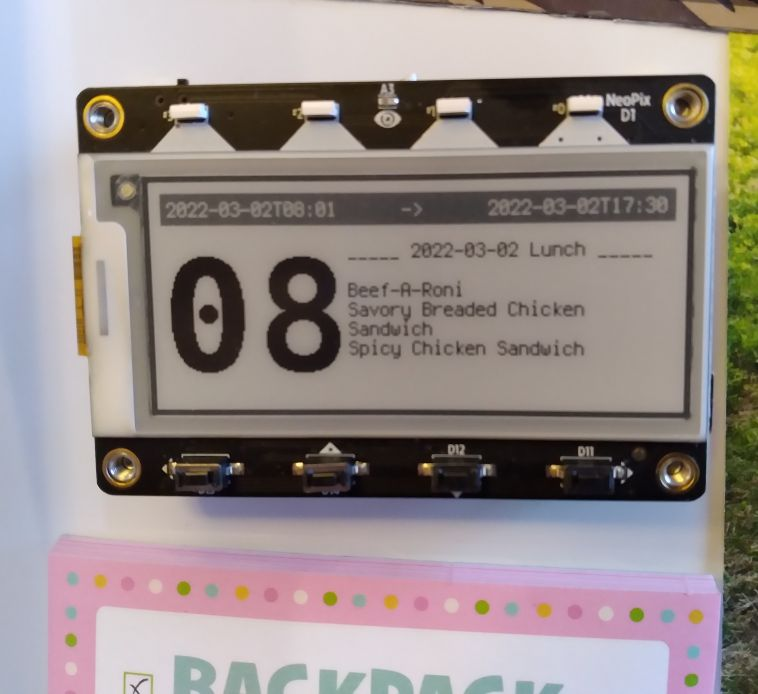
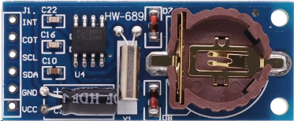
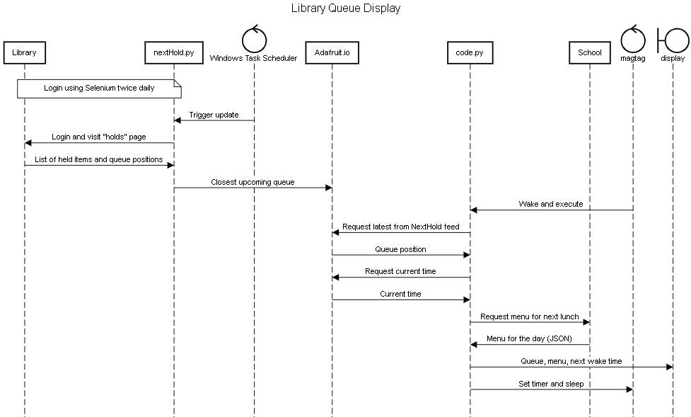

# library_queue
Extract wait list position number from my local library's website and the next upcoming school lunch from the school website, post on a display on the refridgerator.

## Hardware

Adafruit MagTag: https://www.adafruit.com/product/4800

PCF8563 RTC module (HW-689)

Note: The PCF8563 uses I2C to communicate with MagTag. Connect the module to the Stemma QT port on the MagTag, and the VCC pin will power the module without the need for an extra battery. The SDA and SCL pins need pull-up resistors (I used 3.3k, but you should be fine with anything up to 10k).

## Fonts

For the queue numbers, I used Deja Vu Sans Mono - Bold:
https://fontlibrary.org/en/font/dejavu-sans-mono#DejaVu%20Sans%20Mono-Bold

I used FontForge to trim the font down to just the digits and the letter 'M' following these instructions:
https://learn.adafruit.com/custom-fonts-for-pyportal-circuitpython-display/conversion
Then generated an 88px bitmap font for the large numbers.

## Function

The process this device uses to perform its updates is described in the following sequence diagram:

(Made using https://sequencediagram.org/)
