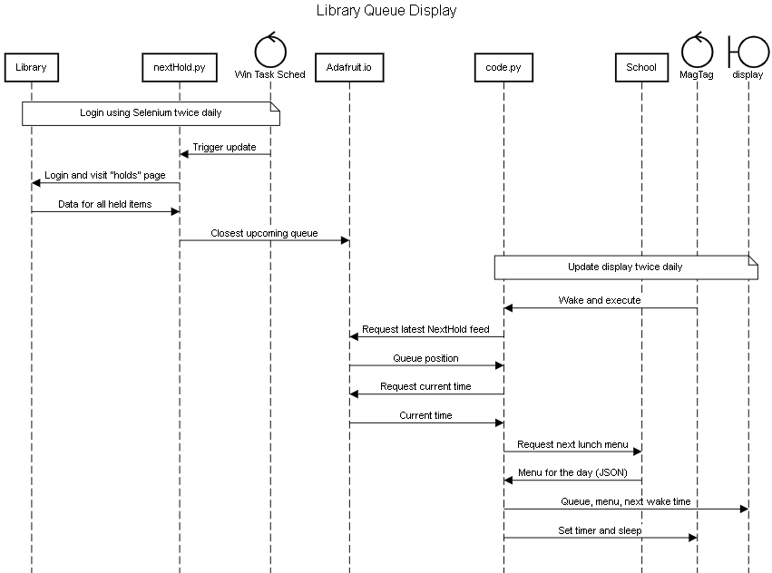

# library_queue
Extract wait list position number from my local library's website

For the queue numbers, I used Deja Vu Sans Mono - Bold:
https://fontlibrary.org/en/font/dejavu-sans-mono#DejaVu%20Sans%20Mono-Bold

I used FontForge to trim the font down to just the digits and the letter 'M' following these instructions:
https://learn.adafruit.com/custom-fonts-for-pyportal-circuitpython-display/conversion
Then generated an 88px bitmap font for the large numbers.

The process this device uses to perform its updates is described in the following sequence diagram:

(Made using https://sequencediagram.org/)
